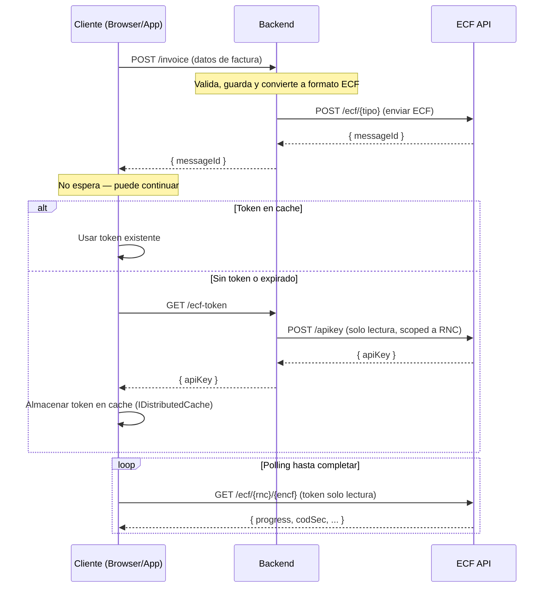

# DGII ECF

| Paquetes  |              |
|-----------|--------------|
| SDK  |[](https://www.nuget.org/packages/SSDDO.ECF_DGII.SDK)|


SDK oficial para integrar la facturación electrónica (e-CF) en República Dominicana a través del servicio **[ECF SSD](https://ecf.ssd.com.do)**.

## Qué cambió en v3

Las versiones anteriores (`v1`, `v2`) requerían que cada empresa implementara la comunicación directa con la DGII: manejo de certificados, firmado de XML, semilla/token, envío de comprobantes, manejo de errores, reintentos, almacenamiento, etc. Todo eso era responsabilidad del desarrollador.

**La v3 cambia el enfoque completamente.** Ahora el SDK se conecta a la plataforma [ECF SSD](https://ecf.ssd.com.do), que se encarga de:

- ✅ Firmado de comprobantes (XML signing)
- ✅ Autenticación con la DGII (semilla/token)
- ✅ Envío y recepción de e-CF
- ✅ Validación emisor-receptor
- ✅ Almacenamiento seguro
- ✅ Reintentos automáticos
- ✅ Manejo de certificados digitales

**Tu único trabajo es:** registrarte en [ecf.ssd.com.do](https://ecf.ssd.com.do), completar la certificación DGII, obtener tu API key, y enviar tus comprobantes con este SDK.

## Comenzar

### 1. Regístrate en [ecf.ssd.com.do](https://ecf.ssd.com.do)

Crea tu cuenta y obtén tu API Key. Luego contacta al equipo de ECF SSD para integrar y certificar tu sistema (la certificación es para tu plataforma, no para las empresas de tus clientes). Una vez certificado, podrás usar el ambiente de producción. Si vienes de otro proveedor, ECF SSD soporta migración.

### 2. Instala el paquete

```sh
dotnet add package SSDDO.ECF_DGII.SDK
```

### 3. Envía tu primer comprobante

```csharp
using EcfDgii.Client;
using EcfDgii.Client.Generated.Models;

// Configura el cliente con tu API key (JWT obtenido en ecf.ssd.com.do)
var client = new EcfClient(new EcfClientOptions
{
    ApiKey = "tu-jwt-token",        // o usa la variable de entorno ECF_API_KEY
    Environment = EcfEnvironment.Prod
});

// Construye el comprobante (ejemplo e-CF 31)
var ecf = new Ecf31ECF
{
    Encabezado = new Ecf31Encabezado
    {
        IdDoc = new Ecf31IdDoc
        {
            TipoeCF = TipoeCFType.FacturaDeCreditoFiscalElectronica,
            Encf = "E310000000001"
        },
        Emisor = new Ecf31Emisor
        {
            RncEmisor = "123456789",
            RazonSocialEmisor = "Mi Empresa SRL",
            DireccionEmisor = "Calle Principal #1, Santo Domingo",
            FechaEmision = DateTimeOffset.Now
        },
        Totales = new Ecf31Totales
        {
            // montos, ITBIS, etc.
        }
    },
    DetallesItems = new List<Ecf31Item>
    {
        new Ecf31Item
        {
            NombreItem = "Servicio de consultoría",
            IndicadorFacturacion = Ecf31IndicadorFacturacionType.NoFacturable_18Percent,
            CantidadItem = 1,
            PrecioUnitarioItem = 10000.00,
            MontoItem = 10000.00
        }
    }
};

// Envía y espera el resultado
// SendEcfAsync es genérico y soporta los 10 tipos de e-CF (31, 32, 33, 34, 41, 43, 44, 45, 46, 47)
try
{
    EcfResponse resultado = await client.SendEcfAsync(ecf);
    Console.WriteLine($"Comprobante procesado exitosamente!");
    Console.WriteLine($"Estado: {resultado.Progress}");
    Console.WriteLine($"Mensaje DGII: {resultado.Mensaje}");
    Console.WriteLine($"Código seguridad: {resultado.CodSec}");
    Console.WriteLine($"URL impresión: {resultado.ImpresionUrl}");
}
catch (EcfException ex)
{
    Console.WriteLine($"Error: {ex.Message}");
    Console.WriteLine($"Detalle: {ex.Response.Errors}");
}
```

**Eso es todo.** No necesitas manejar XML, firmar documentos, obtener semillas, ni reintentar requests. El servicio ECF SSD se encarga de todo.

## Respuesta (`EcfResponse`)

Cuando `SendEcfAsync` termina exitosamente, retorna un `EcfResponse` con toda la información que necesitas para cumplir con los requisitos de la DGII:

| Campo | Tipo | Descripción |
|-------|------|-------------|
| `ImpresionUrl` | `string` | URL para generar el código QR requerido por la DGII en el comprobante impreso |
| `CodSec` | `string` | Código de seguridad — debe aparecer en el comprobante impreso |
| `FechaFirma` | `DateTimeOffset` | Fecha y hora en que el comprobante fue firmado digitalmente |
| `Estatus` | `EcfEstado` | Estado asignado por la DGII (`Aceptado`, `AceptadoCondicional`, `Rechazado`) |
| `Progress` | `EcfProgress` | Estado del procesamiento (`Queued`, `Sending`, `Polling`, `Finished`, `Error`) |
| `Encf` | `string` | Número de comprobante fiscal electrónico (eNCF) |
| `RncEmisor` | `string` | RNC del emisor |
| `Mensaje` | `string` | Mensaje de respuesta de la DGII |
| `Errors` | `string` | Detalle de errores (si los hay) |
| `MontoTotal` | `double` | Monto total del comprobante |
| `SecuenciaUtilizada` | `bool` | Indica si la secuencia fue utilizada |
| `DgiiEnvironment` | `DGIIEnvironment` | Ambiente DGII donde fue procesado |
| `MessageId` | `string` | Identificador único del mensaje |

### QR e Impresión del Comprobante

La DGII requiere que los comprobantes impresos incluyan un código QR. El `ImpresionUrl` contiene la URL que debe codificarse como QR:

```csharp
EcfResponse resultado = await client.SendEcfAsync(ecf);

// Datos necesarios para el comprobante impreso
string urlQr = resultado.ImpresionUrl;          // codificar como QR
string codigoSeguridad = resultado.CodSec;      // imprimir en el comprobante
DateTimeOffset fechaFirma = resultado.FechaFirma; // fecha de firma digital

// Verificar aceptación
if (resultado.Estatus == EcfEstado.Aceptado)
{
    Console.WriteLine("Comprobante aceptado por la DGII");
    Console.WriteLine($"QR URL: {urlQr}");
    Console.WriteLine($"Código seguridad: {codigoSeguridad}");
    Console.WriteLine($"Firmado: {fechaFirma}");
}
```

## Configuración

### Variables de Entorno

| Variable       | Descripción                                      |
|---------------|--------------------------------------------------|
| `ECF_API_KEY` | JWT Bearer token (obtenido en ecf.ssd.com.do)    |
| `ECF_API_URL` | URL base (solo si necesitas override)             |

### Ambientes

| Ambiente | URL | Uso |
|----------|-----|-----|
| Test     | `https://api.test.ecfx.ssd.com.do` | Desarrollo y pruebas |
| Cert     | `https://api.cert.ecfx.ssd.com.do` | Proceso de certificación DGII |
| Prod     | `https://api.prod.ecfx.ssd.com.do` | Producción |

### Opciones de Polling

`SendEcfAsync` espera automáticamente a que la DGII procese el comprobante. Puedes personalizar el comportamiento:

```csharp
var resultado = await client.SendEcfAsync(ecf, new PollingOptions
{
    InitialDelayMs = 1000,      // espera inicial entre consultas
    MaxDelayMs = 30000,         // espera máxima entre consultas
    MaxRetries = 60,            // máximo de reintentos
    BackoffMultiplier = 2,      // multiplicador exponencial
    TimeoutMs = 120000          // timeout total (2 minutos)
});
```

## Tipos de Comprobantes

| TipoeCF | Ruta | Descripción |
|---------|------|-------------|
| `FacturaDeCreditoFiscalElectronica` | `/ecf/31` | Factura de Crédito Fiscal |
| `FacturaDeConsumoElectronica` | `/ecf/32` | Factura de Consumo |
| `NotaDeDebitoElectronica` | `/ecf/33` | Nota de Débito |
| `NotaDeCreditoElectronica` | `/ecf/34` | Nota de Crédito |
| `ComprasElectronico` | `/ecf/41` | Compras |
| `GastosMenoresElectronico` | `/ecf/43` | Gastos Menores |
| `RegimenesEspecialesElectronico` | `/ecf/44` | Regímenes Especiales |
| `GubernamentalElectronico` | `/ecf/45` | Gubernamental |
| `ComprobanteDeExportacionesElectronico` | `/ecf/46` | Exportaciones |
| `ComprobanteParaPagosAlExteriorElectronico` | `/ecf/47` | Pagos al Exterior |

## Ejemplo completo — Factura de Crédito Fiscal (e-CF 31)

El SDK genera modelos específicos por tipo de comprobante (`Ecf31ECF`, `Ecf31Encabezado`, etc.) con todas las propiedades tipadas. Este es un ejemplo completo de una Factura de Crédito Fiscal con ITBIS, impuestos adicionales, descuentos y montos no facturables:

```json
{
  "encabezado": {
    "idDoc": {
      "encf": "E310000051630",
      "TipoeCF": "FacturaDeCreditoFiscalElectronica",
      "TipoPago": "Contado",
      "TipoIngresos": "01",
      "TablaFormasPago": [
        {
          "FormaPago": "Efectivo",
          "MontoPago": 1015.25
        }
      ],
      "IndicadorMontoGravado": "ConITBISIncluido",
      "FechaVencimientoSecuencia": "2028-12-31T00:00:00"
    },
    "Emisor": {
      "RNCEmisor": "131460941",
      "FechaEmision": "2026-01-10",
      "DireccionEmisor": "AVE. ISABEL AGUIAR NO. 269, ZONA INDUSTRIAL DE HERRERA",
      "RazonSocialEmisor": "DOCUMENTOS ELECTRONICOS DE 02"
    },
    "Totales": {
      "ITBIS1": 18,
      "MontoGravadoI1": 762.71,
      "MontoGravadoTotal": 762.71,
      "TotalITBIS1": 137.29,
      "TotalITBIS": 137.29,
      "MontoNoFacturable": 100.0,
      "ImpuestosAdicionales": [
        {
          "TipoImpuesto": "002",
          "TasaImpuestoAdicional": 2,
          "OtrosImpuestosAdicionales": 15.25
        }
      ],
      "MontoImpuestoAdicional": 15.25,
      "MontoTotal": 1015.25,
      "MontoPeriodo": 1015.25
    },
    "Version": "Version1_0",
    "Comprador": {
      "RNCComprador": "131880681",
      "RazonSocialComprador": "DOCUMENTOS ELECTRONICOS DE 03"
    }
  },
  "DetallesItems": [
    {
      "MontoItem": 1016.95,
      "NombreItem": "Iphone 18 Pro max",
      "NumeroLinea": 1,
      "CantidadItem": 1,
      "UnidadMedida": "Unidad",
      "PrecioUnitarioItem": 1016.95,
      "IndicadorFacturacion": "ITBIS1_18Percent",
      "IndicadorBienoServicio": "Bien",
      "TablaImpuestoAdicional": [
        {
          "TipoImpuesto": "002"
        }
      ]
    },
    {
      "MontoItem": 100.0,
      "NombreItem": "Costo de Envío",
      "NumeroLinea": 2,
      "CantidadItem": 1,
      "UnidadMedida": "Unidad",
      "PrecioUnitarioItem": 100.0,
      "IndicadorFacturacion": "NoFacturable_18Percent",
      "IndicadorBienoServicio": "Servicio"
    }
  ],
  "DescuentosORecargos": [
    {
      "TipoValor": "$",
      "TipoAjuste": "D",
      "NumeroLinea": 1,
      "MontoDescuentooRecargo": 84.75,
      "DescripcionDescuentooRecargo": "Descuento",
      "IndicadorFacturacionDescuentooRecargo": "ITBIS1_18Percent"
    }
  ]
}
```

## Arquitectura Backend / Frontend

En la mayoría de implementaciones, el backend maneja la lógica de negocio (validación, almacenamiento, conversión) y envía el comprobante. El frontend obtiene un token de solo lectura para consultar el estado directamente.

### Ejemplo: Frontend con IDistributedCache

```csharp
// 1. Enviar la factura al backend
var invoiceResponse = await httpClient.PostAsJsonAsync("/api/v1/invoices", invoiceData);
var result = await invoiceResponse.Content.ReadFromJsonAsync<InvoiceResult>();

// 2. Crear cliente de solo lectura (GetToken se llama automáticamente)
// Requiere IDistributedCache (inyectado vía DI o manual)
var frontend = new EcfFrontendClient(new EcfFrontendClientOptions
{
    GetToken = async () =>
    {
        var response = await httpClient.GetAsync("/api/v1/ecf-token");
        var json = await response.Content.ReadFromJsonAsync<TokenResponse>();
        return json.ApiKey;
    },
    Cache = myDistributedCache, // Instancia de IDistributedCache
    Environment = EcfEnvironment.Prod
});

// 3. Consultar el estado del ECF
var ecf = await frontend.QueryEcfAsync(result.Rnc, result.Encf);
```

### Inyección de Dependencias (ASP.NET Core)

El SDK incluye extensiones para facilitar la configuración en `Program.cs`:

```csharp
// Registrar el cliente principal
builder.Services.AddEcfClient(options => {
    options.ApiKey = builder.Configuration["ECF_API_KEY"];
    options.Environment = EcfEnvironment.Prod;
});

// Registrar el cliente frontend (solo lectura)
builder.Services.AddEcfFrontendClient(options => {
    options.GetToken = async () => { /* lógica para obtener token */ };
    options.Cache = sp.GetRequiredService<IDistributedCache>();
});
```



### Flujo detallado

1. El **cliente** (browser/app) envía los datos de la factura al **backend** (`POST /invoice`, `/order`, `/sale`)
2. El **backend** valida, guarda y convierte la factura interna al formato ECF
3. El **backend** envía el ECF a la API de ECF SSD (`POST /ecf/{tipo}`) y recibe un `messageId`
4. El **backend** retorna el `messageId` al cliente — **el cliente no espera**, puede continuar
5. Cuando el cliente necesita consultar el estado del ECF, usa `EcfFrontendClient` que internamente:
    - Verifica si hay un **token de solo lectura** en el `IDistributedCache`
    - Si **no existe o expiró**: llama a `GetToken()` (que el consumidor provee), luego almacena el token en el cache.
    - Si la API retorna **401**: automáticamente llama a `GetToken()` de nuevo, actualiza el cache, y reintenta.
6. El cliente hace **polling** directamente contra la API de ECF SSD (`GET /ecf/{rnc}/{encf}`) hasta que `progress` sea `Finished`.

> **`SendEcfAsync`** es una conveniencia que encapsula envío + polling en una sola llamada. Ideal para scripts o backends simples sin frontend.

## Acceso de Alto Nivel

El SDK proporciona métodos de alto nivel en `EcfClient` para las operaciones más comunes, alineados con el SDK de TypeScript:

```csharp
// Gestión de empresas
var empresas = await client.GetCompaniesAsync(rncs: new[] { "123456789" });
await client.UpsertCompanyAsync(new UpsertCompanyRequest { /* ... */ });

// Certificados
var cert = await client.GetCertificateAsync("123456789");
await client.UpdateCertificateAsync("123456789", streamCert, "password");

// Consultas de comprobantes
var ecf = await client.QueryEcfAsync("123456789", "E310000000001");
var busqueda = await client.SearchEcfsAsync("123456789", page: "1", limit: "10");

// Recepción y Aprobación Comercial (ACECF)
var recepciones = await client.SearchEcfReceptionRequestsAsync(rncs: new[] { "123456789" });
await client.AprobacionComercialAsync(messageId, new SendAcecfRequest { /* ... */ });

// Operaciones DGII
var estatus = await client.EstatusServiciosAsync("123456789");
var trackId = await client.ConsultaTrackIdAsync("123456789", rncEmisor, encf);
```

## Acceso Directo al API (Kiota)

Para operaciones granulares o si prefieres el estilo fluido de Kiota, usa `client.Api`:

```csharp
// Ejemplo: Consultar estado directamente en la DGII vía Kiota
var estado = await client.Api.Dgii["123456789"].Consultaestado.Estado.GetAsync(config =>
{
    config.QueryParameters.RncEmisor = "123456789";
    config.QueryParameters.NcfElectronico = "E310000000001";
    config.QueryParameters.RncComprador = "987654321";
    config.QueryParameters.CodigoSeguridad = "ABC123";
});
```

## Manejo de Errores

| Excepción | Cuándo |
|----------|--------|
| `EcfException` | El comprobante fue procesado pero la DGII lo rechazó |
| `PollingMaxRetriesException` | Se agotaron los reintentos esperando respuesta |
| `PollingTimeoutException` | Se agotó el timeout esperando respuesta |

```csharp
try
{
    var resultado = await client.SendEcfAsync(ecf);
}
catch (EcfException ex)
{
    // La DGII rechazó el comprobante
    Console.WriteLine($"Rechazado: {ex.Response.Errors}");
    Console.WriteLine($"Estado DGII: {ex.Response.Estatus}");
}
catch (PollingTimeoutException)
{
    // El comprobante fue enviado pero no se recibió respuesta a tiempo
    // Puedes consultar el estado después con client.Api.Ecf[rnc][encf].GetAsync()
}
```

## Cancelación

Todas las operaciones async soportan `CancellationToken`:

```csharp
using var cts = new CancellationTokenSource(TimeSpan.FromMinutes(5));
var resultado = await client.SendEcfAsync(ecf, cancellationToken: cts.Token);
```

## Migración desde v2

| v2 (implementación propia) | v3 (ECF SSD) |
|---|---|
| Manejar certificado digital (.p12/.pfx) | Subir certificado una vez en ecf.ssd.com.do |
| Obtener semilla y firmarla | No necesario — el servicio lo maneja |
| Serializar a XML y firmar | No necesario — envías JSON, el servicio firma |
| Enviar XML a la DGII | `await client.SendEcfAsync(ecf)` |
| Parsear respuesta XML | Respuesta tipada `EcfResponse` |
| Implementar reintentos | Polling automático con backoff exponencial |
| `SSDDO.ECF_DGII.Models` + `SSDDO.ECF_DGII.SDK` | Solo `SSDDO.ECF_DGII.SDK` v3 |

## Por qué ECF SSD

> Con la v2 tenías la librería, pero aún debías implementar seguridad, almacenamiento, firmado, manejo de certificados, módulo de recepción, reintentos, y más.

**Con la v3 y [ECF SSD](https://ecf.ssd.com.do):**
- Instalas el paquete NuGet
- Te registras y certificas en [ecf.ssd.com.do](https://ecf.ssd.com.do)
- Envías comprobantes con una línea de código
- El servicio se encarga del firmado, validación, envío a DGII, almacenamiento, y más

Para más información visita [https://ecf.ssd.com.do](https://ecf.ssd.com.do)

____

🇩🇴 Hecho con plátano power

_© Smart Software Development SSD SRL 2026_
