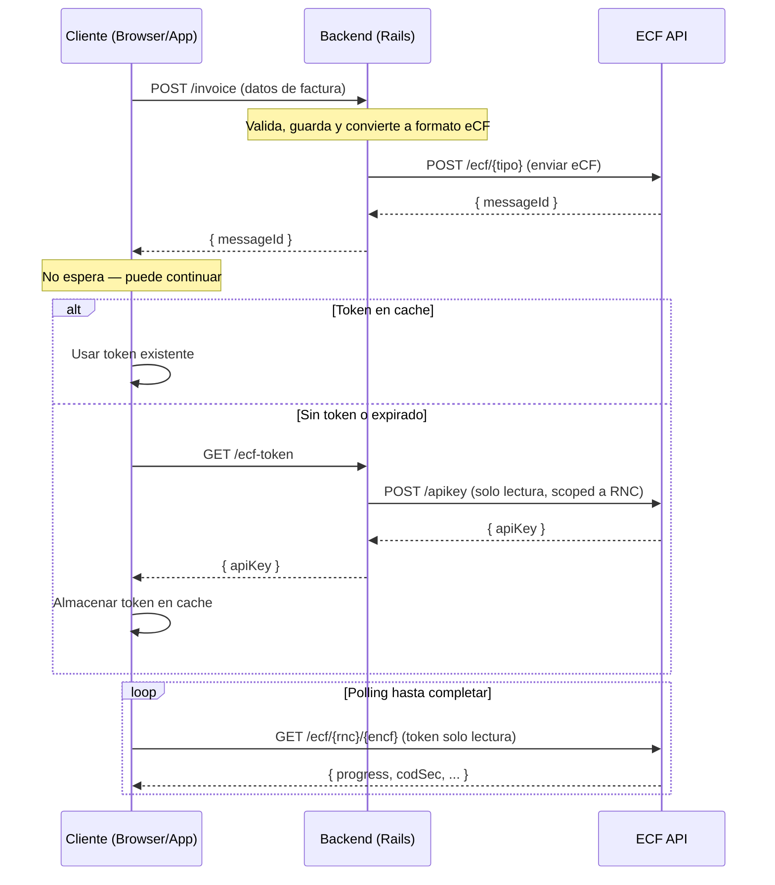

# ecf-dgii

[](https://badge.fury.io/rb/ecf-dgii)
[](LICENSE)

SDK de Ruby para la **API ECF DGII** — Comprobantes Fiscales Electrónicos de la República Dominicana.

---

## Índice

- [Instalación](#instalación)
- [Inicio rápido](#inicio-rápido)
- [Configuración](#configuración)
  - [Autenticación](#autenticación)
  - [Ambientes de trabajo](#ambientes-de-trabajo)
  - [Integración en Ruby on Rails](#integración-en-ruby-on-rails)
- [EcfClient — Backend (Full Access)](#ecfclient--backend-full-access)
  - [Envío de ECF con polling automático](#envío-de-ecf-con-polling-automático)
  - [Operaciones de empresa](#operaciones-de-empresa)
  - [Certificados P12](#certificados-p12)
  - [Consultas DGII](#consultas-dgii)
  - [Recepción y aprobación comercial](#recepción-y-aprobación-comercial)
- [EcfFrontendClient — Frontend (Read-Only)](#ecffrontendclient--frontend-read-only)
- [Polling con backoff exponencial](#polling-con-backoff-exponencial)
- [Manejo de errores](#manejo-de-errores)
- [Arquitectura Backend / Frontend](#arquitectura-backend--frontend)
- [Licencia](#licencia)

---

## Instalación

Añade esta línea al `Gemfile` de tu aplicación:

```ruby
gem 'ecf-dgii'
```

Y luego ejecuta:

```bash
bundle install
```

O instálalo tú mismo con:

```bash
gem install ecf-dgii
```

---

## Inicio rápido

```ruby
require 'ecf-dgii'

# 1. Configurar el cliente
client = EcfDgii::Client.new(api_key: "tu-token-jwt", environment: :test)

# 2. Construir el objeto eCF (en este caso un Ecf31ECF)
ecf = EcfDgii::Generated::Ecf31ECF.new(
  encabezado: EcfDgii::Generated::Ecf31Encabezado.new(
    version: "Version1_0",
    id_doc: EcfDgii::Generated::Ecf31IdDoc.new(
      tipoe_cf: "FacturaDeCreditoFiscalElectronica",
      encf: "E310000051630",
      tipo_pago: "Contado",
      tipo_ingresos: "01",
      tabla_formas_pago: [
        EcfDgii::Generated::Ecf31FormaDePago.new(
          forma_pago: "Efectivo",
          monto_pago: 1015.25
        )
      ],
      indicador_monto_gravado: "ConITBISIncluido",
      fecha_vencimiento_secuencia: "2028-12-31T00:00:00"
    ),
    emisor: EcfDgii::Generated::Ecf31Emisor.new(
      rnc_emisor: "131460941",
      razon_social_emisor: "DOCUMENTOS ELECTRONICOS DE 02",
      direccion_emisor: "AVE. ISABEL AGUIAR NO. 269, ZONA INDUSTRIAL DE HERRERA",
      fecha_emision: "2026-01-10"
    ),
    comprador: EcfDgii::Generated::Ecf31Comprador.new(
      rnc_comprador: "131880681",
      razon_social_comprador: "DOCUMENTOS ELECTRONICOS DE 03"
    ),
    totales: EcfDgii::Generated::Ecf31Totales.new(
      itbis1: 18,
      monto_gravado_i1: 762.71,
      monto_gravado_total: 762.71,
      total_itbis1: 137.29,
      total_itbis: 137.29,
      monto_no_facturable: 100.0,
      impuestos_adicionales: [
        EcfDgii::Generated::Ecf31ImpuestoAdicional2.new(
          tipo_impuesto: "002",
          tasa_impuesto_adicional: 2,
          otros_impuestos_adicionales: 15.25
        )
      ],
      monto_impuesto_adicional: 15.25,
      monto_total: 1015.25,
      monto_periodo: 1015.25
    )
  ),
  detalles_items: [
    EcfDgii::Generated::Ecf31Item.new(
      numero_linea: 1,
      nombre_item: "Iphone 18 Pro max",
      indicador_facturacion: "ITBIS1_18Percent",
      indicador_bieno_servicio: "Bien",
      cantidad_item: 1,
      unidad_medida: "Unidad",
      precio_unitario_item: 1016.95,
      monto_item: 1016.95,
      tabla_impuesto_adicional: [
        EcfDgii::Generated::Ecf31ImpuestoAdicional.new(tipo_impuesto: "002")
      ]
    ),
    EcfDgii::Generated::Ecf31Item.new(
      numero_linea: 2,
      nombre_item: "Costo de Envío",
      indicador_facturacion: "NoFacturable_18Percent",
      indicador_bieno_servicio: "Servicio",
      cantidad_item: 1,
      unidad_medida: "Unidad",
      precio_unitario_item: 100.0,
      monto_item: 100.0
    )
  ],
  descuentos_o_recargos: [
    EcfDgii::Generated::Ecf31DescuentoORecargo.new(
      tipo_valor: "$",
      tipo_ajuste: "D",
      numero_linea: 1,
      monto_descuentoo_recargo: 84.75,
      descripcion_descuentoo_recargo: "Descuento",
      indicador_facturacion_descuentoo_recargo: "ITBIS1_18Percent"
    )
  ]
)

# 3. Enviar el eCF con enrutamiento automático y polling hasta completar
result = client.send_ecf(ecf)
puts "eCF Procesado: #{result.encf} - Estado: #{result.progress}"
```

---

## Configuración

### Autenticación

El API key (token JWT Bearer provisto por SSD) puede pasarse de forma directa o mediante variables de entorno:

```ruby
# Parámetro directo
client = EcfDgii::Client.new(api_key: "tu-token-jwt")

# Variable de entorno ECF_API_KEY
# export ECF_API_KEY=tu-token-jwt
client = EcfDgii::Client.new
```

### Ambientes de trabajo

```ruby
client = EcfDgii::Client.new(environment: :test)   # Pruebas (Predeterminado)
client = EcfDgii::Client.new(environment: :cert)   # Certificación
client = EcfDgii::Client.new(environment: :prod)   # Producción

# URL base personalizada (sobreescribe la del ambiente)
client = EcfDgii::Client.new(base_url: "https://mi-servidor.local/v1")
```

### Integración en Ruby on Rails

El SDK incluye un generador para Rails que configura de forma global el cliente de facturación electrónica.

Ejecuta el generador en tu terminal:

```bash
bundle exec rails generate ecf_dgii:install
```

Esto creará el archivo de configuración `config/initializers/ecf_dgii.rb` con el siguiente contenido:

```ruby
# config/initializers/ecf_dgii.rb

EcfDgii.configure do |config|
  # Token JWT (Bearer) proveído por SSD
  config.api_key = ENV["ECF_API_KEY"]

  # Ambiente de trabajo: :test, :cert, o :prod (por defecto es :test)
  config.environment = ENV.fetch("ECF_ENVIRONMENT", "test").to_sym

  # URL base personalizada (opcional, sobreescribe el ambiente)
  # config.base_url = ENV["ECF_API_URL"]

  # Tiempo de espera máximo para solicitudes HTTP (por defecto es 30 segundos)
  # config.timeout = 30
end
```

Una vez configurado el inicializador, puedes acceder al cliente en cualquier parte de tu aplicación de Rails:

```ruby
client = EcfDgii.client
```

---

## EcfClient — Backend (Full Access)

El `EcfDgii::Client` ofrece acceso completo a la API de ECF: envío de comprobantes, consultas, operaciones de empresa y certificados, consultas DGII, etc.

### Envío de ECF con polling automático

El método `send_ecf` (1:1 con el `sendEcf` del SDK de TypeScript) maneja de forma transparente:

- **Validación completa** — verifica que `tipoeCF`, `rncEmisor` y `encf` estén presentes (mismo comportamiento que TypeScript).
- **Enrutamiento dinámico** — selecciona el endpoint correcto según el atributo `tipoe_cf` de la cabecera.
- **Polling con backoff exponencial** — consulta repetidamente el estado de procesamiento del eCF hasta llegar a un estado terminal (`Finished` o `Error`).
- **EcfError en errores** — si el progreso termina en `Error`, lanza `EcfError` con la respuesta completa.

```ruby
# Envío con polling automático (reemplaza a send_ecf_and_poll)
result = client.send_ecf(ecf)

# Con opciones de polling personalizadas
result = client.send_ecf(ecf, EcfDgii::PollingOptions.new(
  initial_delay: 1.0,
  max_retries: 60,
  timeout: 120.0
))
```

> **Nota:** `send_ecf_and_poll` sigue disponible como alias por compatibilidad, pero ahora `send_ecf` ya incluye el polling (1:1 con TypeScript).

### Operaciones de Empresa

```ruby
# Listar empresas registradas
companies = client.get_companies(page: 1, limit: 10)

# Obtener los datos de una empresa específica por RNC
company = client.get_company_by_rnc("101001010")

# Registrar o actualizar datos de una empresa
req = EcfDgii::Generated::UpsertCompanyRequest.new(
  rnc: "101001010",
  legal_name: "Empresa de Pruebas SRL",
  name: "Empresa de Pruebas"
)
client.upsert_company(req)

# Eliminar empresa
client.delete_company("101001010")
```

### Certificados P12

```ruby
# Obtener el certificado actual de la empresa
certificate = client.get_certificate("101001010")

# Subir/actualizar un certificado de firma digital P12
client.update_certificate("101001010", File.open("ruta/al/certificado.p12", "rb"), "clave-del-certificado")
```

> Los métodos antiguos `get_current_certificate` y `update_certificate_company` siguen disponibles como alias.

### Consultas DGII

```ruby
# Consultar estado actual del eCF
estado = client.consulta_estado("101001010", "101001010", "E310000051630", "131880681", "ABC123")

# Consultar directorio de emisores electrónicos activos en DGII
directorio = client.consulta_directorio_listado("101001010")

# Consultar RFCE (incluye código de seguridad, 1:1 con TypeScript)
rfce = client.consulta_rfce("101001010", "101001010", "E310000051630", "SEC123")

# Consultar estado de procesamiento mediante el track_id obtenido
resultado = client.consulta_resultado("101001010", "track-id-obtenido")

# Obtener estatus general de los servicios de la DGII
estatus = client.estatus_servicios("101001010")
```

### Recepción y aprobación comercial

```ruby
# Buscar solicitudes de recepción
requests = client.search_ecf_reception_requests(page: 1, limit: 10)

# Obtener una solicitud de recepción por RNC y messageId
request = client.get_ecf_reception_request("101001010", "msg_123")

# Enviar aprobación comercial (ACECF) para un messageId
client.aprobacion_comercial("msg_123", body)

# Anular rangos de comprobantes
client.anulacion_rangos("101001010", anulacion_request)

# Firmar semilla
client.firmar_semilla("101001010", xml_body)
```

---

## EcfFrontendClient — Frontend (Read-Only)

El `EcfDgii::FrontendClient` es un cliente restringido que solo expone endpoints **GET** (solo lectura), diseñado para usarse en frontends. El manejo del token es automático:

1. En cada petición, verifica si hay un token en caché. Si no, obtiene uno nuevo y lo almacena.
2. En respuestas `401`, obtiene un token nuevo, actualiza la caché y reintenta la petición.

**¡NUEVO!** — Ahora disponible en Ruby (1:1 con `EcfFrontendClient` del SDK de TypeScript).

```ruby
# Crear un frontend client
frontend = EcfDgii::FrontendClient.new(
  get_token: -> { fetch_fresh_token_from_backend },  # Requerido
  environment: :test
)

# Solo operaciones de lectura disponibles
ecfs = frontend.search_ecfs("131460941", page: 1, limit: 10)
company = frontend.get_company_by_rnc("131460941")
```

### Factory method

```ruby
frontend = EcfDgii.create_frontend_client(
  get_token: -> { fetch_fresh_token_from_backend },
  environment: :test
)
```

### Cache personalizado

Por defecto el token se guarda en `~/.ecf-dgii/token`. Puedes proveer tu propia lógica de caché:

```ruby
frontend = EcfDgii::FrontendClient.new(
  get_token: -> { fetch_fresh_token_from_backend },
  cache_token: ->(token) { Redis.current.set("ecf-token", token) },
  get_cached_token: -> { Redis.current.get("ecf-token") },
  environment: :test
)
```

---

## Polling con backoff exponencial

El SDK incluye un módulo de polling genérico que puedes usar directamente:

```ruby
resultado = EcfDgii::Polling.poll_until_complete do
  client.query_ecf(rnc, encf)
end
```

### Opciones de polling (1:1 con TypeScript)

```ruby
options = EcfDgii::PollingOptions.new(
  initial_delay: 1.0,       # Segundos antes de la primera consulta (default: 1.0)
  max_delay: 30.0,          # Límite máximo de espera entre consultas (default: 30.0)
  max_retries: 60,          # Intentos máximos (default: 60, 0 = ilimitado)
  backoff_multiplier: 2.0,  # Multiplicador del retraso en cada intento (default: 2.0)
  timeout: nil,             # Timeout total en segundos (nil = sin timeout)
  cancellation: -> { stop_polling_flag }  # Callable de cancelación opcional
)
```

### Valores terminales

El polling termina cuando el progreso es `"Finished"` (éxito) o `"Error"` (fallo), igual que el SDK de TypeScript y el contrato de la API.

---

## Manejo de errores

El SDK utiliza una jerarquía de excepciones tipadas, 1:1 con el SDK de TypeScript:

```ruby
begin
  result = client.send_ecf(ecf)
rescue EcfDgii::EcfError => e
  # Error de procesamiento del ECF — incluye la respuesta completa
  puts "Error del ECF: #{e.message}"
  puts "Respuesta completa: #{e.response.inspect}" if e.response
rescue EcfDgii::PollingTimeoutError => e
  puts "El polling tomó más tiempo de lo permitido: #{e.message}"
rescue EcfDgii::PollingMaxRetriesError => e
  puts "Se superó el número máximo de reintentos: #{e.message}"
rescue EcfDgii::Generated::ApiError => e
  puts "Error de API de ECF (Estatus: #{e.code})"
  puts "Respuesta: #{e.response_body}"
rescue ArgumentError => e
  puts "Error de validación: #{e.message}"
rescue => e
  puts "Ocurrió un error inesperado: #{e.message}"
end
```

### Jerarquía de errores

```
StandardError
└── EcfDgii::EcfError          # Error base del SDK (incluye response)
    ├── EcfDgii::PollingTimeoutError    # Timeout de polling
    └── EcfDgii::PollingMaxRetriesError # Máximo de reintentos
```

> `EcfDgii::PollingError` se mantiene como alias de `EcfError` por compatibilidad.

---

## Arquitectura Backend / Frontend



1. Tu backend en Rails convierte las facturas internas a los modelos del eCF y los transmite con `client.send_ecf(ecf)`.
2. La API de ECF responde de inmediato con un `messageId` para que el backend Rails responda al cliente web sin bloquearse.
3. El frontend usa `EcfDgii::FrontendClient` con un token de solo lectura (obtenido via `client.create_api_key`) para hacer polling directamente contra la API de eCF de forma segura.

---

## Licencia

La gema está disponible como software de código abierto bajo los términos de la [Licencia MIT](LICENSE).
